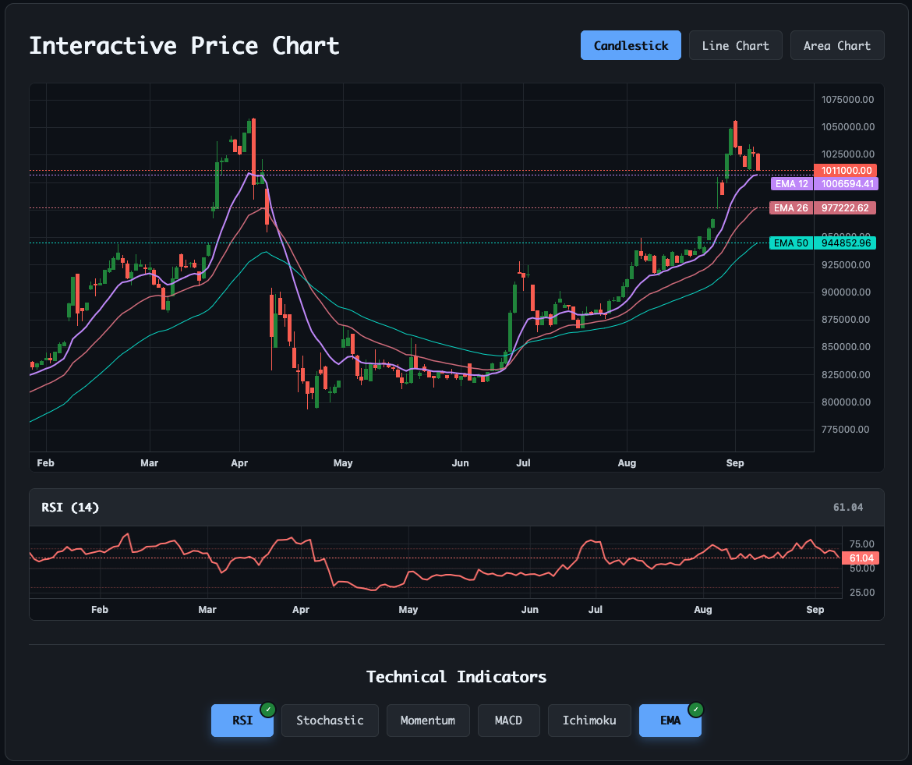

# Euro-Rial-Toman Live Price Dataset

A comprehensive, daily-updated dataset of Euro to Iranian Rial exchange rates (EUR/IRR) with historical data from 2011 to present. This dataset is ideal for financial analysis, economic research, forecasting, and machine learning projects.


## Dataset Overview

- **Time Period**: 2011 - Present (continuously updated)
- **Total Records**: 3,400+ daily price points
- **Data Source**: TGJU.org (Tehran Gold & Jewelry Union)
- **Update Frequency**: Daily (automated via GitHub Actions)
- **Format**: CSV with proper date formatting and integer price structure

## Data Structure

The CSV file contains the following columns:

| Column | Description | Format | Example |
|--------|-------------|--------|---------|
| Open Price | Opening price of the day | Integer | 1012100 |
| Low Price | Lowest price of the day | Integer | 1011700 |
| High Price | Highest price of the day | Integer | 1034100 |
| Close Price | Closing price of the day | Integer | 1029800 |
| Change Amount | Price change amount | String | 15400 |
| Change Percent | Price change percentage | String | 1.52% |
| Gregorian Date | Gregorian date | YYYY/MM/DD | 2025/09/06 |
| Persian Date | Persian/Shamsi date | YYYY/MM/DD | 1404/06/15 |

### Download the Data
You can access the dataset file directly from the `/data/` directory:
- [Euro_Rial_Price_Dataset.csv](data/Euro_Rial_Price_Dataset.csv)

## View Live Dataset on Kaggle:
This dataset is also available on [Kaggle](https://www.kaggle.com/datasets/kooroshkz/euro-rial-toman-live-price-dataset) where you can 

explore, download, and use it directly in Kaggle notebooks.

## Documentation & Charts
<a href="https://kooroshkz.github.io/Euro-Rial-Toman-Live-Price-Dataset/" target="_blank">
  
</a>

Interactive charts and dataset overview are available at:  
[kooroshkz.github.io/Euro-Rial-Toman-Live-Price-Dataset](https://kooroshkz.github.io/Euro-Rial-Toman-Live-Price-Dataset/)

### Loading in Python
```python
import pandas as pd

# Load dataset
df = pd.read_csv('data/Euro_Rial_Price_Dataset.csv')

# Convert date column to datetime
df['Gregorian Date'] = pd.to_datetime(df['Gregorian Date'], format='%Y/%m/%d')

# Price columns are already integers
price_columns = ['Open Price', 'Low Price', 'High Price', 'Close Price']
print(df[price_columns].dtypes)  # All should be int64
```

### Direct Load in Python
```python
# pip install kagglehub[hf-datasets]
import kagglehub

df = kagglehub.load_dataset(
    "kooroshkz/euro-rial-toman-live-price-dataset",
    adapter="huggingface",
    file_path="Euro_Rial_Price_Dataset.csv",
    pandas_kwargs={"parse_dates": ["Gregorian Date"]}
)

print(df.head())
```

### Loading in R
```r
# Load dataset
data <- read.csv("data/Euro_Rial_Price_Dataset.csv", stringsAsFactors = FALSE)

# Convert date column
data$Gregorian.Date <- as.Date(data$Gregorian.Date, format = "%Y/%m/%d")

# View structure
str(data)
```

## Data Quality & Updates

- **Validation**: All price data undergoes validation checks for accuracy
- **Automated Updates**: Dataset is automatically updated daily at 8:00 AM UTC
- **Data Integrity**: Built-in duplicate prevention and format validation
- **Historical Consistency**: Maintains consistent formatting across all time periods
- **Integer Prices**: All price values stored as integers for precise calculations

## Technical Implementation

This dataset is maintained using an automated web scraping system that:

- Monitors TGJU.org for new exchange rate data
- Validates and processes new records
- Maintains data consistency and prevents duplicates
- Automatically commits updates to the repository

## Contributing

If you find data inconsistencies or have suggestions for improvements, please open an issue in the GitHub repository.

## License

This project is licensed under the MIT License - see the [LICENSE](LICENSE) file for details.

## Citation

If you use this dataset in your research or projects, please cite:

```
Euro-Rial-Toman Live Price Dataset
Author: Koorosh Komeili Zadeh
Source: https://github.com/kooroshkz/Euro-Rial-Toman-Live-Price-Dataset
Data Source: TGJU.org (Tehran Gold & Jewelry Union)
Date Range: 2011 - Present
```

### Keywords
EUR to Rial dataset, Euro to Toman dataset, Iran exchange rate CSV, EUR/IRR daily price, foreign exchange Iran dataset, TGJU data, time series currency dataset

- Available in [English](README.md) | [فارسی](README.fa.md)

## Disclaimer

This dataset is provided for educational and research purposes only. Exchange rates are sourced from publicly available data and should be independently verified for trading or investment decisions. The authors are not responsible for any financial losses resulting from the use of this data.
